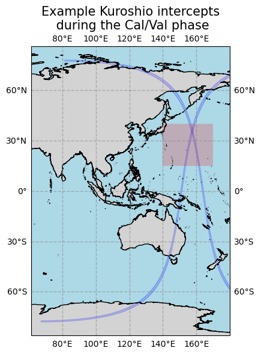
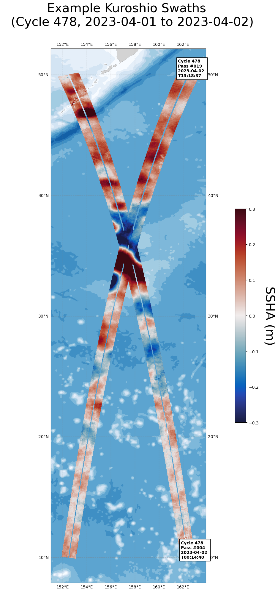
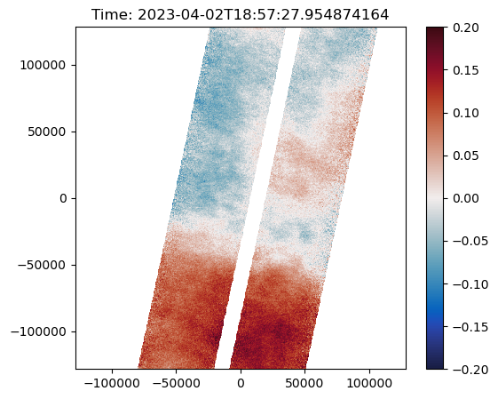

# SWOT-data-analysis

⚠️ Formalizing a collection of scripts I (Tatsu) have been using to analyze SWOT data. More to come as I formalize things. Contributions welcome!

## Getting started

## Quick Examples 

1. [Find swaths using orbit shapefile](examples/001_Find_swaths_using_orbit_shapefile.ipynb). The first notebook gives an example of using the SWOT orbit shapefiles to find specific orbits. You can also use the .kmz orbit files provided by NASA to look at the tracks using Google Earth ([our group's example here](https://earth.google.com/earth/d/1a7fJPbcbpzafBJjMzASRo6DcGhQb9Sq_?usp=sharing)). 

   
   
1. [Download 1-day repeat swaths for the Kuroshio region](examples/002_Download_1-day_repeat_swaths_for_kuroshio_and_subset.ipynb). An example notebook for pulling SWOT data from the AVISO+ server. We're currently limited to using [sftp](https://en.wikipedia.org/wiki/SSH_File_Transfer_Protocol), which is rather inefficient. Hopefully in the future we will be able to access the data using zarr. In the meantime this solution works.

1. [Plot 1-day repeat swaths with bathymetry](examples/003_Plot_1-day_repeat_swaths_off_of_Kuroshio.ipynb). Once you are able to download the data plotting the actual swaths is fairly straightforward using `cartopy` and `matplotlib`. This notebook also gives an example of using some helper scripts to open and automatically subset the SWOT data (referred to as "data_loaders").

   

1. [Calculate along-swath spectrum](examples/004_Calculate_the_spectrum_of_the_kuroshio_swaths.ipynb). Once we have a swath loaded we can go ahead and calculate the along-swath SSH spectrum to get a sense for SWOT's effective resolution and how the SWOT noise floor changes over time. I still need to add some plots here and get the notebook working smoothly, but the code is here if you would like to try playing around with it. 

1. [Regrid a swath section to a regular grid](examples/005_Regrid_Kuroshio.ipynb). Next, I've added some helper scripts from Scott Martin's NeursOST project to resample SWOT data to a regular lat-lon grid. These scripts will technically work on any xarray dataset with lat-lon coordinates.

   
